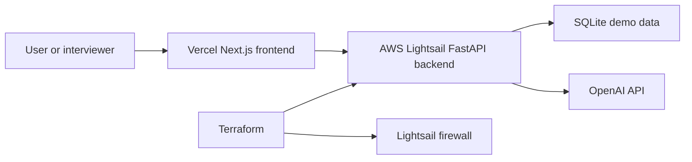
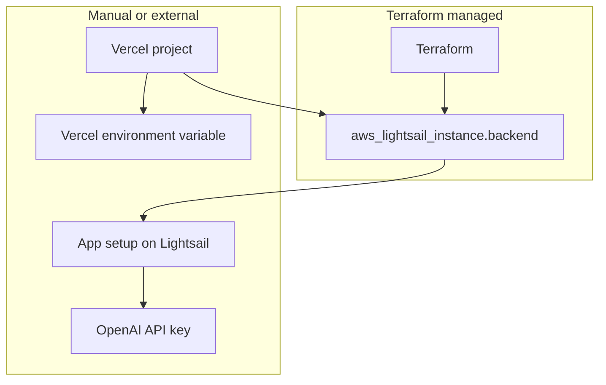
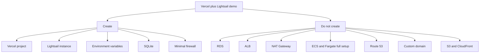
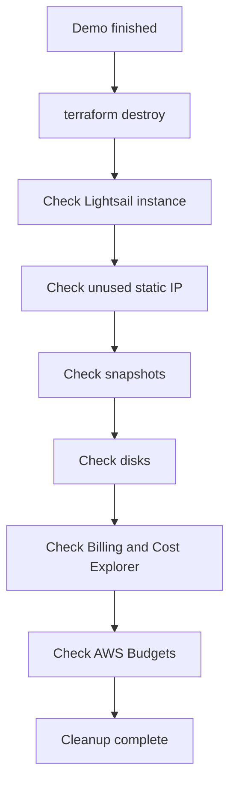

# Cloud Deployment Flowcharts

## 全体構成

```mermaid
graph LR
    User[User or interviewer] --> Frontend[Vercel Next.js frontend]
    Frontend --> Backend[AWS Lightsail FastAPI backend]
    Backend --> Database[SQLite demo data]
    Backend --> AI[OpenAI API]
    Terraform[Terraform] --> Backend
    Terraform --> Firewall[Lightsail firewall]
```

## Terraform管理範囲

```mermaid
graph TB
    subgraph TerraformManaged[Terraform managed]
        TF[Terraform]
        LS[aws_lightsail_instance.backend]
        TF --> LS
    end

    subgraph ManualManaged[Manual or external]
        VP[Vercel project]
        VE[Vercel environment variable]
        KEY[OpenAI API key]
        APP[App setup on Lightsail]
    end

    VP --> VE
    VP --> LS
    LS --> APP
    APP --> KEY
```

## 作成するもの / 作成しないもの

```mermaid
graph TD
    Demo[Vercel plus Lightsail demo]

    Demo --> Create[Create]
    Demo --> Skip[Do not create]

    Create --> VercelProject[Vercel project]
    Create --> LightsailInstance[Lightsail instance]
    Create --> Env[Environment variables]
    Create --> SQLite[SQLite]
    Create --> Firewall[Minimal firewall]

    Skip --> RDS[RDS]
    Skip --> ALB[ALB]
    Skip --> NAT[NAT Gateway]
    Skip --> ECS[ECS and Fargate full setup]
    Skip --> Route53[Route 53]
    Skip --> Domain[Custom domain]
    Skip --> S3CF[S3 and CloudFront]
```

## 削除フロー

```mermaid
graph TD
    Start[Demo finished] --> Destroy[terraform destroy]
    Destroy --> CheckLS[Check Lightsail instance]
    CheckLS --> CheckIP[Check unused static IP]
    CheckIP --> CheckSnapshot[Check snapshots]
    CheckSnapshot --> CheckDisk[Check disks]
    CheckDisk --> Billing[Check Billing and Cost Explorer]
    Billing --> Budget[Check AWS Budgets]
    Budget --> Done[Cleanup complete]
```
