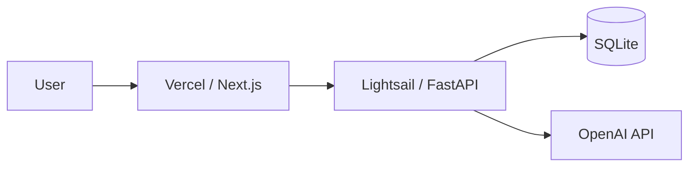

# 初期デモ構成

このプロジェクトでは、フロントエンドをVercel、バックエンドをLightsailに配置する。

```mermaid
flowchart LR
  User[User] --> Vercel[Vercel / Next.js]
  Vercel --> Lightsail[Lightsail / FastAPI]
  Lightsail --> SQLite[(SQLite)]
  Lightsail --> OpenAI[OpenAI API]
```
