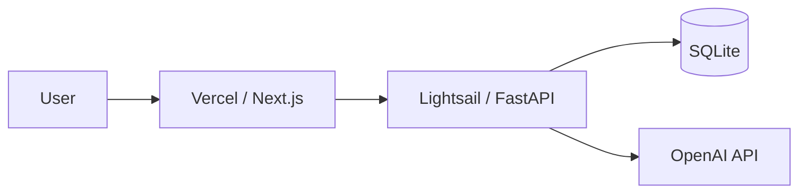

# 初期デモ構成

このプロジェクトでは、フロントエンドをVercel、バックエンドをLightsailに配置する。

## 採用理由

- フロントエンドはVercelに配置し、Next.jsのデプロイを簡単にする
- バックエンドはLightsailに配置し、低コストでFastAPIを動かす
- OpenAI APIキーはバックエンド側だけで管理し、フロントエンドには置かない
- 初期デモではSQLiteを使い、RDSなどの追加課金要素を避ける
- LightsailはTerraformで作成・削除し、検証後に確実に削除できるようにする

## 初期デモで採用しないもの

- RDS
- ALB
- NAT Gateway
- ECS / Fargate
- 独自ドメイン
- 本番用の高可用構成

